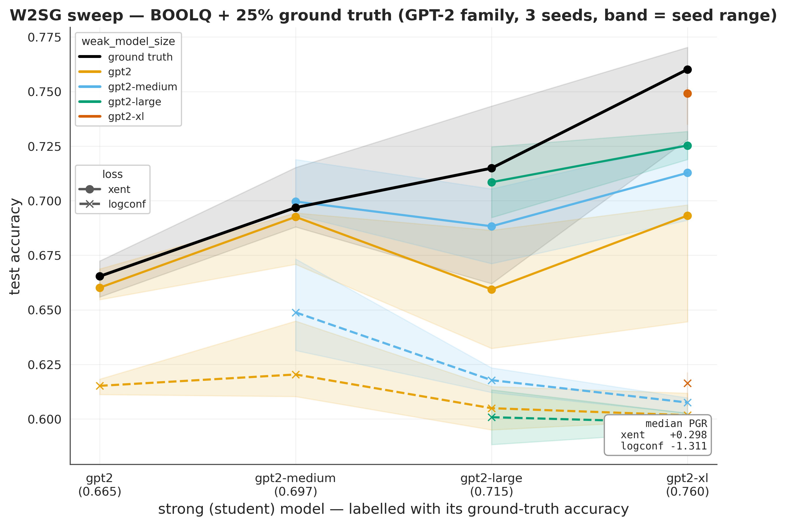
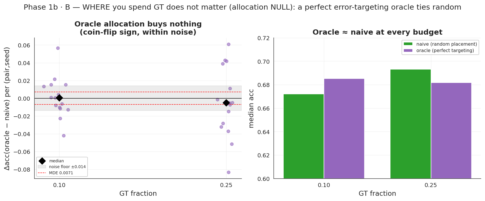
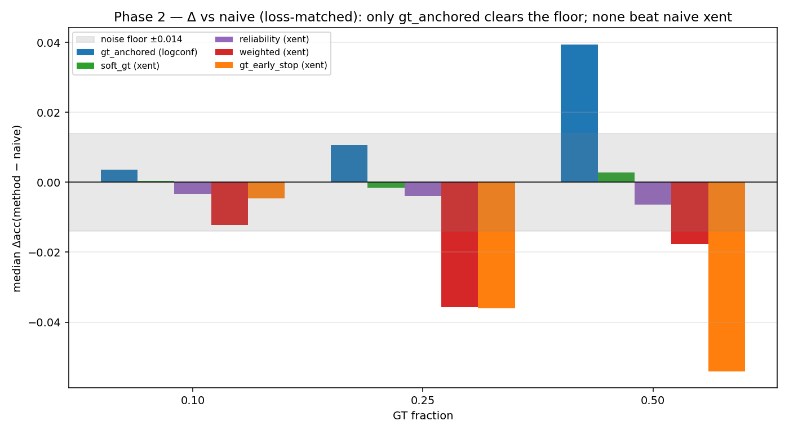
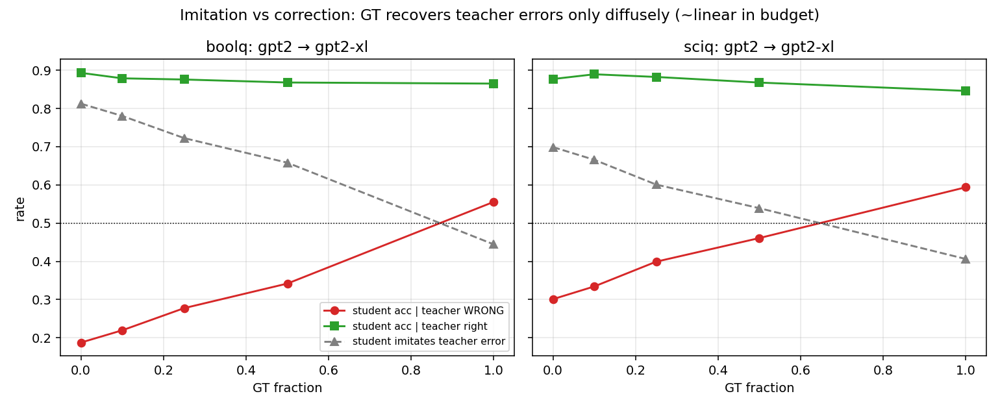
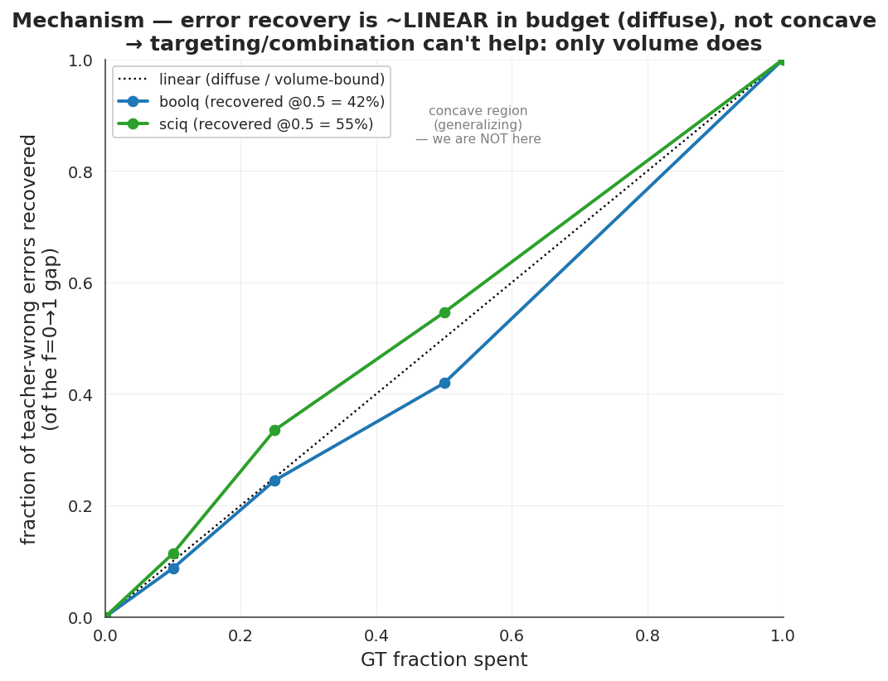
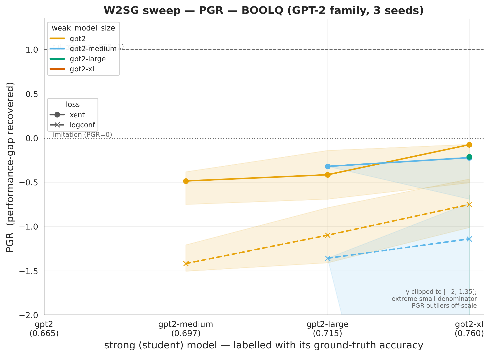
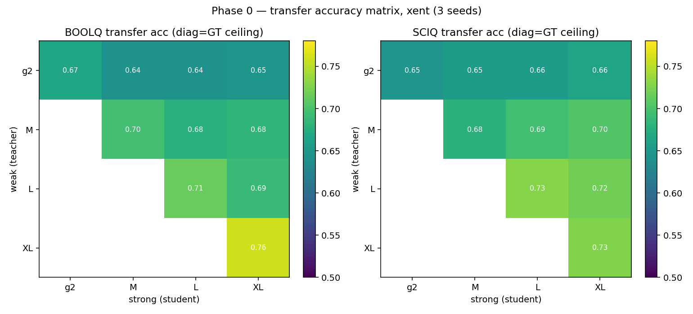
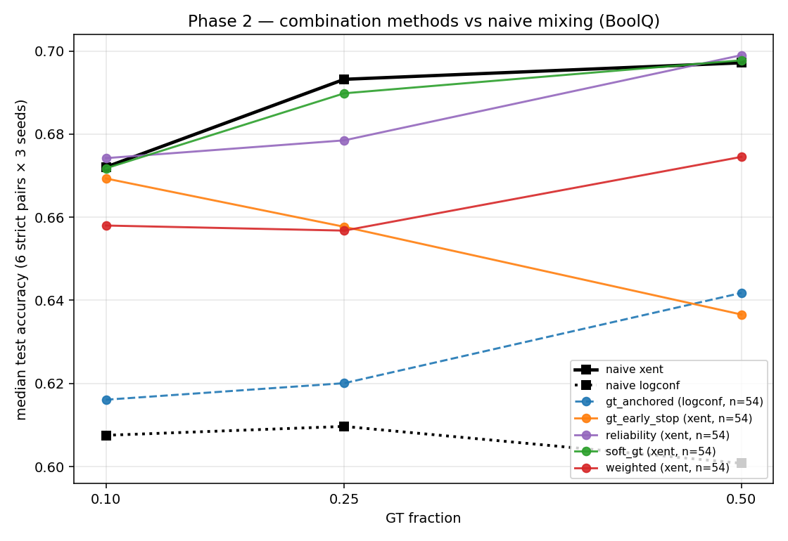
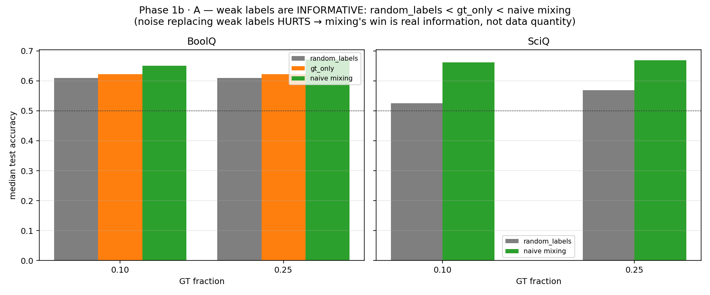

<!-- _class: lead -->
<!-- _paginate: false -->

# A small supervision budget barely improves weak-to-strong generalization

**On GPT-2 / BoolQ, mixing a ground-truth budget into the weak labels helps only modestly — and *where* and *how* it is spent show little effect.**

A consistent account: the student largely reproduces the teacher's errors, and ground truth corrects mainly the examples it directly labels — so the effective lever is *volume*, not placement or combination.

GPT-2 family · BoolQ + SciQ · 3 seeds · paired per-(pair,seed) contrasts · pre-registered

<!--
We take the W2SG setup and add a ground-truth budget — a fraction of strong labels mixed into the
weak teacher's labels — and ask three things: how much budget is needed, where to place it, and how
to combine it with the weak labels. The headline is on the slide; the rest is the evidence for each
and a mechanism that ties them together.
-->

---

## Scope & setup

- **Setting:** weak-to-strong generalization — a strong *student* is trained on a weak *teacher's* labels.
- **Extension:** a *supervision budget* — mix a fraction of ground-truth ("strong") labels into the weak labels, and sweep that fraction.
- **Models:** **GPT-2 family only** — gpt2 / medium / large / xl, with within-family student–teacher pairs.
- **Tasks:** **BoolQ** (required) + **SciQ** (cross-task check).
- **Readout:** median **PGR** across the model sweep (raw accuracy primary; PGR secondary).

3 seeds · paired per-(pair,seed) contrasts · pre-registered · gpt2-large (seed 1) excluded by rule

<!--
Within-family pairs give six strict weak-below-strong pairs per seed. BoolQ is the required task,
SciQ the independent check. Raw accuracy is primary and PGR secondary, because PGR denominators are
small and unstable for closely-matched pairs.
-->

---

## GPT-2 sweep at 25% ground truth

- GPT-2 family, BoolQ, **25% ground truth mixed into the weak labels** — standard sweep format.
- **Median PGR (xent) = +0.30** across the sweep; logconf (dashed) sits well below xent.
- The 0% baseline is **−0.27**, making the +0.30 a **small** positive shift.

<!--
Each coloured line is a weak teacher; the x-axis is the student labelled with its own ground-truth
accuracy; solid is cross-entropy, dashed is the confidence loss. The inset is median PGR over the
six strict pairs — the standardised number requested. logconf sits below xent at every student,
which is why it's dropped from here on.
-->

---

## How *much*? — back-loaded, and saturating by ~75%

- Up to **10% GT**, the gain over the 0% baseline stays within the **0.014 noise floor**.
- Median xent PGR is **back-loaded**: −0.22 → **+0.30** (0.25) → +0.28 (0.50) → **+0.90** (0.75) → +1.04 (1.0).
- The 0.75 point: the **0.50→0.75 step is the largest**, and **0.75→1.0 is within noise**.
- A pre-registered concave-knee-at-25% prediction was **refuted**, and retracted after the multi-seed data.

<!--
The brief suggested starting at a high fraction and lowering it to probe sample efficiency. Doing
that, efficiency is poor here: nothing distinguishable from weak-only below 10%, first robust
positive at 25%, and most of the movement between 50% and 75%. Accuracy is monotone; PGR is noisier
because of the denominator.
-->

---

## *Where* it's spent — within noise (allocation null)

- An **oracle** uses held-out GT to place the budget exactly on the **teacher-wrong rows** — an upper bound on any allocation rule.
- Paired against random placement at matched budget: oracle − random = **+0.0006** (0.10), **−0.0049** (0.25) — both below the **MDE (0.0071)** we could detect.
- If the best possible placement ties random, allocation heuristics have **little to gain** on this testbed.

<!--
The oracle is a ceiling, not a deployable method — it needs the labels it's allocating. Per-(pair,
seed) paired contrast at matched budget; the difference is within noise and changes sign between
fractions, and it replicates on SciQ. So before building an allocation method, the ceiling already
says there's nothing to capture here.
-->

---

## *How* it's combined — within noise (combination null)

- Five methods vs naive mixing at matched budget: **M1** GT up-weighting · **M2** soft-GT targets · **M3** GT-anchored logconf · **M4** reliability-weighted weak labels · **M5** GT-based early stopping.
- Median Δ vs naive ≈ **0** across {0.10, 0.25, 0.50}; none shifts the curve left or raises the ceiling.
- **M3 (gt-anchored)** is the only method above the floor (+0.040 at 0.50), but it recovers logconf toward xent **without exceeding plain xent** (0.642 vs 0.697).

<!--
Each method is a different hypothesis about how to use the GT rows. gt-anchored exempts GT rows from
the confidence blend, so it was the registered most-likely-positive; it does what it's designed to —
fixes logconf — but doesn't beat the simplest baseline. The other four are within noise or slightly
negative.
-->

---

## Mechanism: the student reproduces the teacher's **errors**

- Probe: gpt2 → gpt2-xl, joining teacher and student **per-example** test predictions.
- On teacher-wrong rows at 0% GT, the student reproduces the teacher's wrong answer **81% (BoolQ) / 70% (SciQ)** of the time.
- Errors are **largely inherited, not independent** — the student adopts the teacher's specific wrong answers.

<!--
If the student were making its own independent mistakes, targeting teacher-wrong rows would be
pointless. It isn't — the failures are mostly inherited. So in principle the budget could be aimed
at exactly the wrong rows, which is what the oracle did. The next slide is why that still doesn't
help.
-->

---

## Mechanism: recovery is ~linear in budget (volume-bound)

- Recovery of teacher-wrong rows is **~linear in budget** — 42% / 55% of the 0→100% gap recovered at 50%, tracking *y = x* rather than a concave curve.
- A GT label's marginal value appears **roughly independent of which row it lands on**.
- This is the condition that produces both nulls: when recovery is volume-bound, placement (*where*) and re-weighting (*how*) have **little leverage**.

<!--
This is the link between the mechanism and the two nulls. Concave recovery would mean a little
targeted GT goes a long way, and then placement would matter. We see roughly linear recovery
instead — a GT label is worth about the same wherever it goes — which is the condition under which
the allocation and combination nulls are expected rather than surprising.
-->

---

## Pre-registration scorecard — hits and misses

**Phase 1** (P1–P6, git-anchored before seeds 0/2 existed)

| | Prediction | Outcome |
|---|---|---|
| P1 | knee at ~25% | ✗ refuted — back-loaded, no knee (retracted) |
| P2 | ≤10% GT inert | ✓ within noise |
| P3 | mixing > GT-only | ✓ (confound named → resolved in 1b) |
| P4 | logconf null | ✓ inert at every budget |
| P5 | scale interaction (gap → more GT) | — underpowered at GPT-2 scale |
| P6 | 0.25–0.50 plateau | ✓ flat in that range |

**Phase 2** (M1–M5, registered before the portfolio ran): M2 ✓ null, M4 ✓ null (as flagged uncertain), **M3 ◑** (strongest bet — rescues logconf, still < xent), M1/M5 ✗ negative.

<!--
The point of pre-registration here: later seeds and the whole Phase-2 portfolio were out-of-sample
tests, so the misses are real misses. P1 was our own headline and we retracted it; P5 we report as
not-testable rather than refuted, because gpt2-large's instability removes the pairs that test it.
-->

---

## Experiments across the three axes

| Axis | Experiment | Outcome |
|---|---|---|
| How much | 8-point fraction sweep, 0 → 1 | back-loaded, saturates ~0.75 |
| Where | error-targeting oracle + random control | null — within MDE |
| How | 5 combination / loss methods | null — 1 above floor, still < xent |
| Loss | xent vs logconf | logconf inert → dropped |
| Tasks | BoolQ + SciQ | replicates on both |
| Mechanism | imitation-vs-correction probe | recovery ~linear in budget |
| Robustness | 8-seed variance; 5-seed baseline pass | exclusion by rule; 3-seed conclusions hold |

Coverage spans the three axes, plus loss, task, and robustness checks.

<!--
Each row is a separate pre-registered or controlled experiment. The mechanism probe is the only one
that's explanatory rather than a test; the rest are measurements with a stated effect size and floor.
-->

---

## Takeaways

- Reproduced W2SG on the GPT-2 family and extended it to a supervision-budget setting.
- Decomposed the budget question into *how much / where / how* — a powered null on the last two, and a back-loaded, saturating curve on the first.
- One account — **inherited errors plus volume-bound recovery** — is consistent with all three.
- So the binding constraint here looks like **scale**, not allocation or combination.

<!--
The synthesis. The constraint statement leads into next steps: if recovery is volume-bound, the
interesting variable is the capability gap, not the supervision strategy.
-->

---

<!-- _class: tight -->

## Next steps

1. **Vary the capability gap.** Re-run the budget sweep with a bigger student–teacher gap (a weaker / handicapped teacher; larger families if allowed). If recovery turns from linear to **concave**, targeted GT starts to generalize — and *where* / *how* would matter again.
2. **Are the teacher's mistakes structured?** Train a **cheap** probe — reusing the saved predictions — to find, from the student's features, where the teacher is wrong. If it can't, the errors are scattered, with no pattern for allocation to exploit.
3. **Schedule the budget over training.** We mixed GT and weak labels in a fixed ratio throughout, never varying the *timing*. Compare GT-first / annealed / interleaved — recent work suggests the schedule can matter more than the loss.
4. **Iterate the loop.** Use the budget-trained student as the next teacher and repeat at the same total GT. Does a budget that's null in one pass add up over rounds?

Ordered by relevance to the mechanism: (1) tests it directly · (2) explains it · (3–4) open new axes.

<!--
(1) is the discriminating experiment — W2SG-gain theory says recovery should grow with the gap, and
that's where targeting could begin to pay. (2) is near-free and gives the mechanism behind the
allocation null directly. (3) follows iterative-label-refinement results under weak supervision; (4)
is the bootstrapping question. All but (1) fit comfortably in budget.
-->

---

<!-- _class: lead -->
<!-- _paginate: false -->

# Appendix

frac=0 reproduction (acc + PGR) · transfer heatmap · per-method × pair detail · de-confound · cross-task

---

## Appendix — frac=0 reproduction

- Standard W2SG sweep, GPT-2 family, BoolQ, **0% GT**, PGR axis.
- Median xent PGR **−0.27**; several pairs fall below the imitation line — BoolQ is low-signal at 0% GT.
- This is the baseline the 25%-GT sweep is measured against.

---

## Appendix — transfer tracks the teacher more than student capacity

- With the teacher fixed, scaling the student adds **~+0.003**; with the student fixed, a better teacher adds **~+0.04**.
- Transfer tracks the teacher far more than student capacity — the static counterpart of the imitation result.

---

## Appendix — combination portfolio, per-method detail

- All five methods track naive mixing across {0.10, 0.25, 0.50}.
- gt-anchored (logconf) is the only method above the floor; it recovers logconf but stays under xent.

---

## Appendix — weak labels carry information (de-confound)

- Ordering: **random < gt_only < naive mixing** (15/15 BoolQ, 18/18 SciQ pairs).
- Replacing weak labels with noise reduces accuracy → the mixing gain reflects weak-label information, not just added rows.
