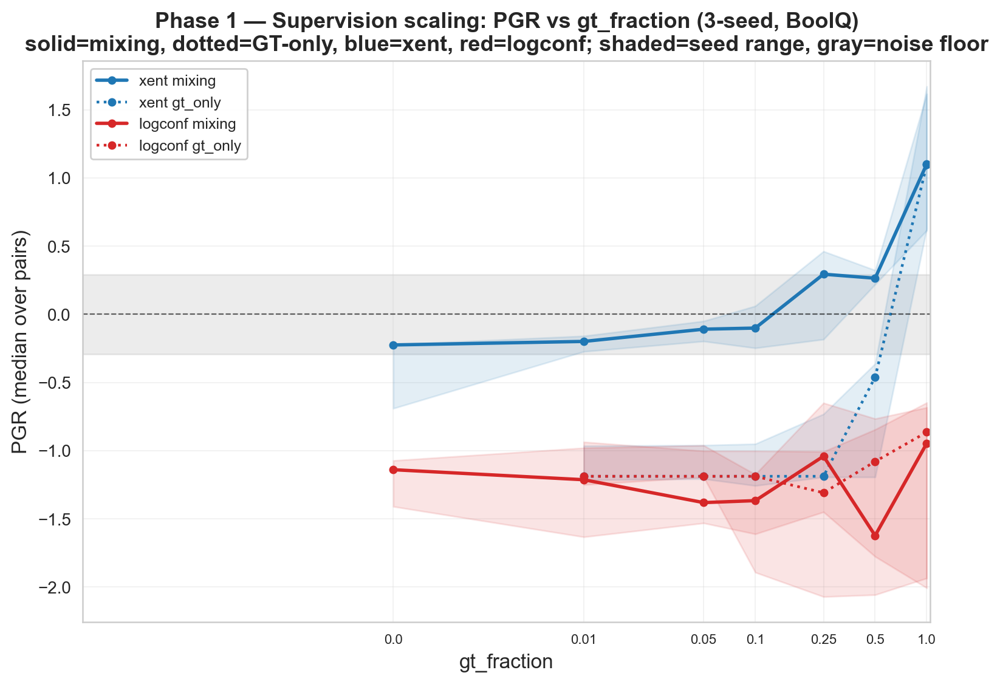
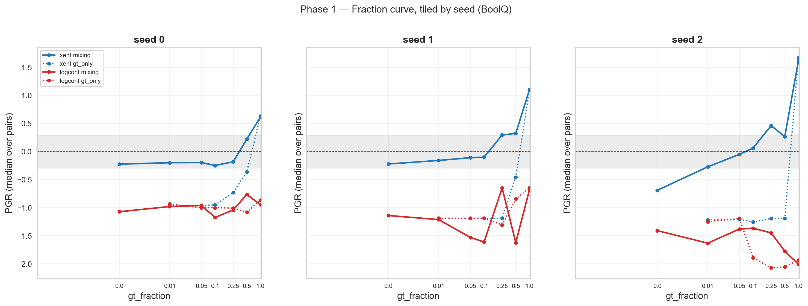
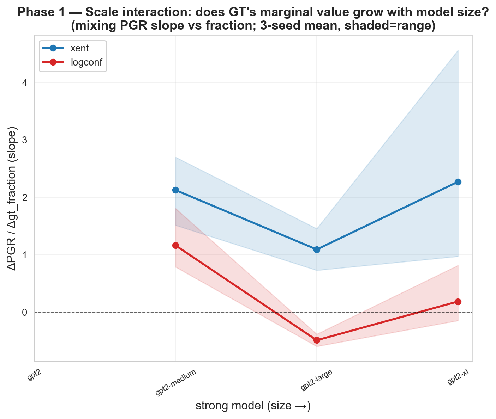
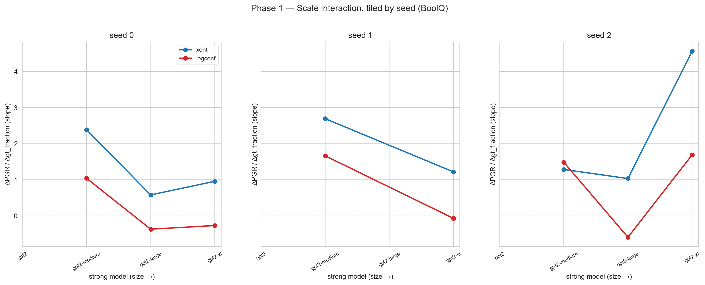
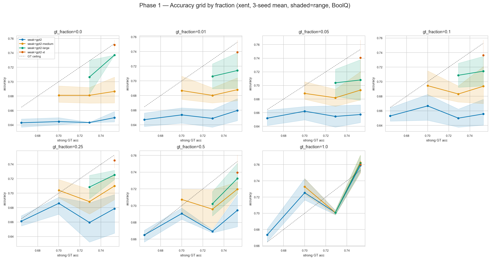
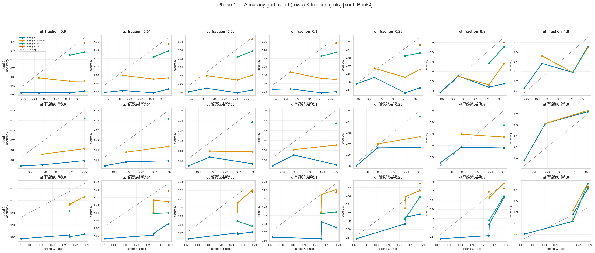
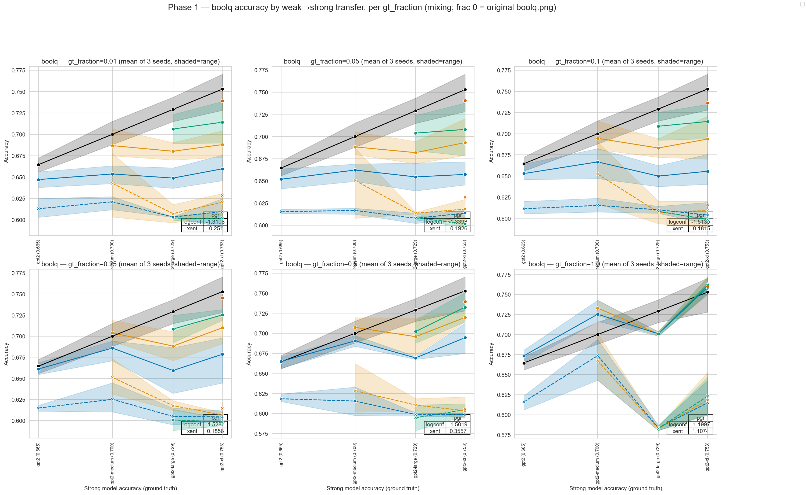

# Phase 1 Results — Supervision-Scaling Fraction Curve + Scale Interaction

> Narrative spine / decision log: [`../RESEARCH_PATH.md`](../RESEARCH_PATH.md).

**Dataset:** BoolQ · **Models:** GPT-2 family · **Seeds:** 0, 1, 2 · **Losses:** xent, logconf
**Runs:** 504 canonical (3 seeds × [120 mixing + 48 GT-only]) + baselines.
Consolidated in `phase1_results.csv` (582 rows; uniqueness-guarded — no stale/duplicate runs).

> **How to read this document.** I lead with **raw accuracy**, because it is the directly
> interpretable quantity and is stable. PGR (the field-standard metric) is reported second,
> with an explicit caveat: its denominator (GT-ceiling − weak-floor) is small for adjacent
> model pairs, so per-pair PGR is high-variance and can exaggerate small accuracy changes.
> I aggregate as *median over pairs, then across seeds*, and read every effect against a
> measured **noise floor**. Where a pre-registered prediction was wrong, I say so.

## Data integrity: one excluded run

Seed-1 `gpt2-large` trained on ground truth to **0.662** — *below* `gpt2-medium` (0.697) and
barely above `gpt2` (0.665). A "stronger" model that underperforms a smaller one has failed
to train, and any PGR dividing by that degenerate ceiling is meaningless. This is **not
corruption**: the S5 regeneration re-ran the exact config and reproduced 0.662 (training is
deterministic under fixed seed), so it is a real bad-optimization outcome for that seed.

I apply a **pre-stated, outcome-independent filter**: *drop any GT ceiling that fails to
exceed the next-smaller model's GT accuracy.* Under this rule seed-1 `gpt2-large` is excluded
as both weak teacher and strong student (`EXCLUDE = {(1, "gpt2-large")}` in `scripts/phase1/plot_phase1.py`).

**Follow-up variance study (8 fresh seeds) confirms this is instability, not an outlier.**
Re-running `gpt2-large` GT on BoolQ across seeds 11–18 (`results/phase0/gpt2large_variance/`)
gives, with the existing seeds 0–2, **11 accuracies: mean 0.709, std 0.030, range [0.649,
0.743]**, with a **recurring low mode: 3/11 seeds (27%) below `gpt2-medium`'s 0.700** (seed 12 =
0.6485 is even lower than seed 1's 0.662). So seed-1's value is a representative draw from a
~27% failure mode, not a fluke — `gpt2-large` GT training is **optimization-unstable** here
(likely lr=1e-5 on the unstable edge). Consequences: the failed-ceiling filter cleanly catches
all three low-mode seeds; the `gpt2-large` ceiling is unreliable at 3 seeds (a 3-seed sample
has ~58% chance of containing a low draw), which **independently supports reporting the scale
interaction as inconclusive** (Result 4). Phase-1 numbers use seeds 0/2 (both high-mode), so
they reflect the stable mode, but gpt2-large carries this instability caveat throughout.

## Headline (what the data actually supports)

1. **GT mixing helps xent transfer, but the benefit is gradual, back-loaded, and budget-gated
   — there is no "knee," and a small GT budget does essentially nothing.** Below `gt_fraction`
   ≈ 0.10 the accuracy gain over the pure-weak baseline is within the noise floor; it becomes
   detectable only at 0.25, robust at 0.50, and is *largest at 1.0*.
2. **Mixing > GT-only at every budget < 1.0** — the largest, most consistent effect in the
   data. But this is **partially confounded by training-set size** (GT-only is data-starved at
   low fractions); see the caveat. It is the strongest *candidate* headline, not a clean one.
3. **logconf is inert at every budget, including 100% GT.** No accuracy gain at any fraction.
4. **Scale interaction is inconclusive** (underpowered, and `gpt2-large` — the mid-point — is
   2-seed after exclusion). We make no claim either way.

## Result 1 — Does GT mixing help? (xent, raw accuracy)

Δaccuracy of mixing@frac vs the pure-weak baseline (`gt_fraction=0`), pooled over (pair, seed),
seed-1 `gpt2-large` excluded. **Noise floor = 0.014** (median per-pair 3-seed accuracy range;
see Milestone 5):

| gt_fraction | median Δacc | % of (pair,seed) positive | vs noise floor |
|---|---|---|---|
| 0.01 | +0.0006 | 50% | nil (coin-flip) |
| 0.05 | +0.0041 | 64% | within noise |
| 0.10 | +0.0028 | 64% | within noise |
| 0.25 | +0.0239 | 79% | ~1.7× noise |
| 0.50 | +0.0300 | 100% | ~2× noise, unanimous |
| 1.00 | +0.0746 | 100% | large, unanimous |

**Read.** The response is monotonic but **back-loaded**: marginal return per unit GT is *not*
front-loaded (≤0.10 is flat and within noise; the largest absolute gain is 0.50→1.00). In raw
accuracy GT mixing **never hurts** — it does nothing, then helps. Practically: on this task,
**if you can only afford ≤10% GT, naive mixing buys you nothing.** You need a real budget
(≥25–50%) for a reliable gain.

## Result 2 — Mixing vs GT-only (the strongest effect, with a confound)

Accuracy of mixing minus GT-only at the *same* strong model and budget (xent, excluded):

| gt_fraction | 0.01 | 0.05 | 0.10 | 0.25 | 0.50 | 1.00 |
|---|---|---|---|---|---|---|
| median(mix − GT-only) | +0.047 | +0.048 | +0.053 | +0.070 | +0.047 | −0.000 |

Mixing beats GT-only by 5–7 accuracy points everywhere below full GT, collapsing to zero at
1.0 (where both train on identical all-GT data). This is the cleanest, most seed-consistent
contrast in Phase 1.

**The honest caveat we must attach.** At low fractions GT-only trains on a *handful* of rows
(1% = 47; 25% = 1,179) while mixing always uses all 4,714 transfer rows. **Most of the
low-fraction gap is therefore a training-set-size effect, not evidence that weak labels are
informative.** The one partial de-confound is `gt_fraction=0.50`, where GT-only already has
2,357 rows and mixing still wins by +0.047 — suggestive that weak labels add value beyond
quantity, but even there mixing has 2× the rows. A clean test (GT-only vs mixing at **equal
total rows**) is not in this dataset and is flagged for Phase 2. So Result 2 is the strongest
*candidate* headline, but it cannot yet be stated as "weak supervision is intrinsically
valuable."

## Result 3 — logconf is inert at every budget

Δaccuracy of logconf mixing vs the logconf pure-weak baseline (excluded):

| gt_fraction | 0.01 | 0.05 | 0.10 | 0.25 | 0.50 | 1.00 |
|---|---|---|---|---|---|---|
| median Δacc | +0.004 | +0.001 | −0.002 | −0.001 | −0.005 | −0.0003 |
| % positive | 67% | 60% | 47% | 47% | 27% | 47% |

Even at **100% GT**, logconf transfer does not improve over its weak baseline. Mechanistic
explanation (`weak_to_strong/loss.py:106`): the auxiliary confidence term replaces ~half the
target with the model's own hardened self-predictions (`target = labels·(1−coef) +
strong_preds·coef`, `coef→0.5`), so even when every label is ground truth the target is
~50% self-prediction — the GT signal is structurally diluted and the model cannot reach the
GT ceiling. Clean, robust null.

## Result 4 — Scale interaction: inconclusive

ΔPGR/Δgt_fraction (mixing) per strong model, mean [seed range]:

| strong model | xent slope | n seeds |
|---|---|---|
| gpt2-medium | +2.12 [1.29, 2.69] | 3 |
| gpt2-large | +0.81 [0.58, 1.03] | **2** (seed-1 excluded) |
| gpt2-xl | +2.25 [0.96, 4.56] | 3 |

The slope is positive at all sizes but **non-monotonic** (large dips; xl's range is enormous),
and the model we'd most want to characterize (`gpt2-large`, the mid-point) is now 2-seed. There
is **no support** for "the marginal value of GT grows with student size." We report this as
**underpowered / no claim**, not as a null with a mechanism. (`gpt2` never appears as the
*strong* model in a weak<strong pair, so it has no slope.) logconf slopes hover near zero with
no trend, consistent with Result 3.

## Pre-registered predictions, scored honestly

| # | Prediction (from `plans/phase1.md`) | Verdict |
|---|---|---|
| P1 | xent curve **concave / diminishing returns**, knee at 0.10–0.25, *most benefit from a small GT budget* | **REFUTED.** Curve is convex/back-loaded; ≤0.10 is inert. The benefit is front-loaded in the prediction, back-loaded in the data. |
| P2 | logconf flat or slightly increasing | **Partly held.** Flat — but "slightly increasing" is not supported; no recovery even at 100% GT. |
| P3 | Mixing > GT-only at every fraction (weak labels add coverage; GT-only data-starved) | **Held as stated** (mixing wins; mechanism = coverage, as predicted). But it does **not** establish weak-label informativeness beyond data quantity (confound above). |
| P4 | xent: larger students extract more value (positive slope vs size) | **Not supported.** Slope non-monotonic and underpowered. |
| P5 | logconf: no scale trend | **Held** (trivially — logconf inert at all scales). |

The "knee at 0.25" that an earlier draft asserted was an artifact: a *PGR zero-crossing* (which
is just "student matches weak teacher," an arbitrary reference), amplified by small PGR
denominators and by the seed-1 `gpt2-large` anomaly. The raw-accuracy curve has no elbow.

## Milestone 5 — Noise floor

Per-pair accuracy spread across the 3 seeds for the baseline condition (`gt_fraction=0`, xent
transfers), seed-1 `gpt2-large` excluded — "what zero effect looks like":

```
Noise floor (baseline xent, 3-seed per-pair accuracy range):
  Mean   per-pair range: 0.0165
  Median per-pair range: 0.0144
  Max    per-pair range: 0.0358  (gpt2-medium → gpt2-xl)
```

Every effect above is read against this. Result-1 gains at ≤0.10 fall under it; gains at
≥0.25 exceed it.

## Figures (`results/plots/`)

Seed-1 `gpt2-large` excluded throughout; accuracy-grid lines connect in x-order (GT accuracy),
not model-size order.

**Figure 1 — Fraction curve, PGR vs gt_fraction.** Solid = mixing, dotted = GT-only; blue =
xent, red = logconf. Shaded = seed range; gray = noise band. *PGR shown as the field-standard
view; read against Result 1 for the stable raw-accuracy story.*




**Figure 2 — Scale interaction (inconclusive; see Result 4).**




**Figure 3 — Accuracy grid** (accuracy vs strong-model GT accuracy, per fraction; color = weak
model, dashed = GT ceiling). Lines climb toward the diagonal as gt_fraction rises.




**Figure 4 — Per-fraction transfer plots** (Phase-0 `boolq.png` format, transfer lines from
mixing). `gt_fraction=0` is the original `boolq.png`.



Full-res panels:
[0.01](../plots/boolq_gf=0.01.png) · [0.05](../plots/boolq_gf=0.05.png) ·
[0.10](../plots/boolq_gf=0.1.png) · [0.25](../plots/boolq_gf=0.25.png) ·
[0.50](../plots/boolq_gf=0.5.png) · [1.00](../plots/boolq_gf=1.0.png)

## Secondary: 3-seed median PGR (with the denominator caveat)

Two-stage aggregate (per-seed median over pairs, then median across seeds), exclusion applied:

| gt_fraction | xent mixing | xent GT-only | logconf mixing | logconf GT-only |
|---|---|---|---|---|
| 0.00 | −0.225 | — | −1.14 | — |
| 0.01 | −0.199 | −1.19 | −1.21 | −1.19 |
| 0.05 | −0.110 | −1.19 | −1.38 | −1.19 |
| 0.10 | −0.101 | −1.19 | −1.37 | −1.19 |
| 0.25 | +0.294 | −1.19 | −1.04 | −1.31 |
| 0.50 | +0.264 | −0.46 | −1.62 | −1.08 |
| 1.00 | +1.101 | +1.10 | −0.95 | −0.87 |

Consistent with the raw-accuracy story (xent rises and crosses zero between 0.10 and 0.25;
logconf stays deeply negative). The large negative GT-only PGRs at low fractions are the
data-starvation effect of Result 2, now in PGR units.

## Threats to validity

- **Scale of models.** GPT-2 on BoolQ; near-zero baseline PGR. Effects may not transfer to
  frontier scale (the standard W2SG caveat).
- **PGR denominator instability.** Adjacent-pair denominators are small; we mitigate with
  two-stage aggregation and raw-accuracy-first reporting, but single-pair PGR remains noisy.
- **Mixing-vs-GT-only confound.** Not yet de-confounded for training-set size (Result 2).
- **gpt2-large is 2-seed** after the principled exclusion; its scale behavior is under-measured,
  and we don't know if 0.662 reflects genuine bimodal instability without more seeds.
- **Single dataset.** Replication on a second task (Phase 3) is required before any of this is
  load-bearing.

## Decision gate → Phase 2

1. **Budget for strategy tests: gt_fraction ∈ {0.10, 0.25}.** Not because of a knee — because
   that is the low-budget regime where naive mixing is weak/within-noise, so a smarter
   allocation or combination has the most room to beat it. The curve does **not** saturate above
   0.25 (it rises to 1.0), so high-budget tests would mostly re-measure the naive ceiling.
2. **Drop logconf from Phase 2** (and run xent-only) — inert at every budget across all seeds,
   including 100% GT. Halves compute. Carry the null as a result; optionally keep one
   logconf-repair cell (Axis C) as a deliberate probe.
3. **Do not foreground scale interaction.** Underpowered; if it matters to a Phase-2 claim, add
   seeds for `gpt2-large` first.
4. **Add an equal-total-rows GT-only vs mixing cell** to de-confound Result 2 — currently the
   strongest effect, currently confounded.

**Additional figures (`plot_phase1_extra.py`):**
- `../plots/phase1_pgr_vs_fraction.png` — PGR vs fraction (xent vs logconf): gradual/back-loaded, logconf negative.
- `../plots/phase1_knee_diagnostic.png` — **paired** Δacc vs a linear reference: ≤0.10 within noise, value at 0.25+, on/below the line → back-loaded, **not a frugal knee** (matches +0.003/+0.024/+0.030/+0.075).
- `../plots/phase1_mixing_vs_gtonly.png` — mixing − gt_only gap (the data-quantity confound → de-confounded in Phase 1b · A).

## Reproduce

```
python3 scripts/phase1/consolidate_phase1.py   # -> phase1_results.csv (uniqueness-guarded)
python3 scripts/phase1/plot_phase1.py                          # Figures 1–3 (+ by-seed); EXCLUDE applied
python3 scripts/phase1/plot_phase1_boolq_per_fraction.py       # Figure 4
python3 scripts/phase1/plot_phase1_extra.py                    # PGR / no-knee / mixing-vs-gtonly
```
The exclusion rule and the noise floor are defined in code; remove `EXCLUDE` to see the
unfiltered (seed-1-`gpt2-large`-included) version.
